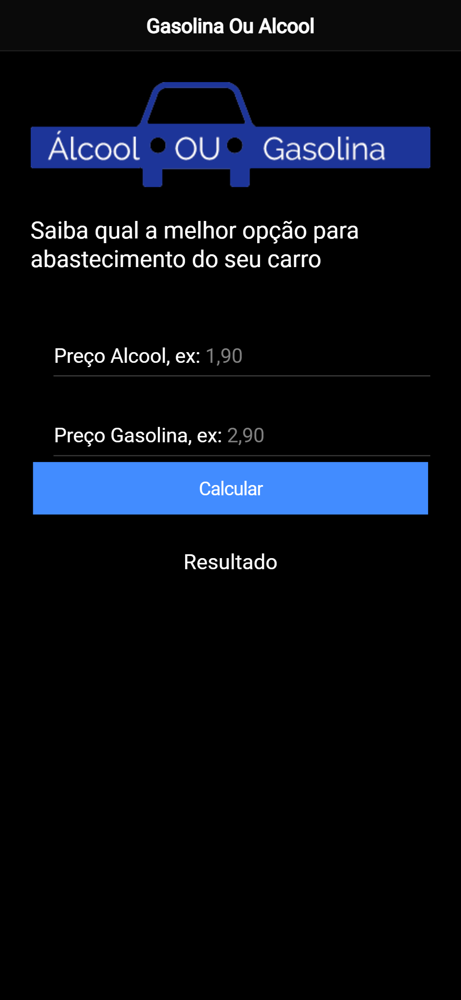

# Gasolina Ou Alcool

Saiba qual o combustivel com o melhor custo/beneficio!

Este projeto foi feito para desenvolver meus conhecimentos com IONIC 5

### Tecnologias Utilizadas
- HTML
- CSS/SCSS
- Javascript
- Typescript
- Ionic/Angular

### Para visualizar o projeto:

1° Clone o repositorio

2° Dentro da pasta abra um terminal e execute o comando ionic serve

